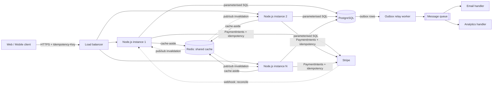
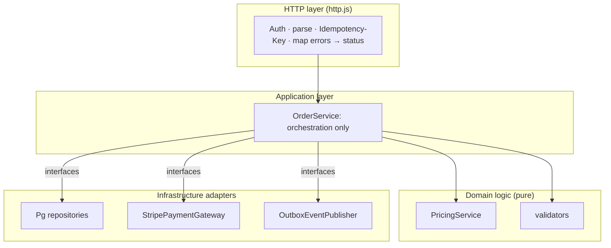
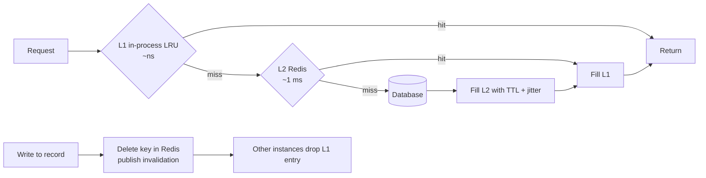

# Architecture Overview

## 1. Why we generate an architecture overview

Code shows *what* the system does. An architecture overview explains **how the parts fit together and why they are shaped that way**. We write one because:

| Purpose | What it gives the team |
|---|---|
| **Shared mental model** | Everyone can answer "where does this logic live?" without reading every file |
| **Faster onboarding** | A new engineer understands boundaries and data flow in minutes, not days |
| **Records decisions and trade-offs** | Future changes respect *why* something was chosen (e.g. "cache-aside, not write-through") instead of undoing it by accident |
| **Exposes risk early** | Failure modes, scaling limits and single points of failure are visible *before* production teaches them |
| **Enables safe parallel work** | Clear boundaries and contracts let several developers change different parts without collisions |
| **Reviews and interviews** | It shows reasoning, not just code: what was considered, rejected, and accepted |

An overview is a **map, not a manual**: it stays short, focuses on boundaries, flows, and decisions, and is updated when those change.

---

## 2. System context



**Key property: the app tier is stateless.** No instance holds unique state, so instances can be added, removed, or crash without losing data. All state lives in PostgreSQL, Redis, or the queue.

## 3. Layers inside one service



Dependencies point **inward**: `OrderService` knows interfaces, never concrete Postgres/Stripe classes. Concrete wiring happens in one composition root (`compose.example.js`).

## 4. Order creation sequence

```mermaid
sequenceDiagram
    participant C as Client
    participant API as OrderService
    participant DB as PostgreSQL
    participant PAY as Stripe
    participant Q as Outbox / Queue

    C->>API: POST /orders (Idempotency-Key)
    API->>DB: find order by idempotency key
    alt already PAID
        API-->>C: 201 same order (no new charge)
    else new
        API->>API: validate + price (integer cents)
        API->>DB: TX: insert PENDING order + reserve stock
        API->>PAY: charge (idempotency key = order id)
        alt declined
            API->>DB: mark FAILED, release stock
            API-->>C: 402
        else timeout / unknown
            API-->>C: 503 (order stays PENDING; retry or webhook settles)
        else success
            API->>DB: mark PAID
            API->>Q: publish OrderPlaced (best effort)
            API-->>C: 201
        end
    end
```

## 5. Caching architecture



## 6. Scalability principles applied

| Principle | Where it shows up |
|---|---|
| **Stateless services** | Any instance can serve any request; sessions/state externalised |
| **Shared cache with graceful degradation** | Redis cache-aside, fail-open to the DB |
| **Async for non-critical work** | Email/analytics via outbox + queue; never on the request path |
| **Idempotency everywhere money moves** | Client key, DB unique constraint, Stripe idempotency key |
| **Batch, don't loop** | `WHERE id = ANY($1)` replaces N+1 queries |
| **Clear interfaces between components** | Ports/adapters → swap providers, test with fakes |
| **Design for failure** | Typed errors, unknown-outcome handling, reconciliation, circuit breaker on cache |
| **Horizontal scale by default** | Add app instances; shard Redis; add read replicas for Postgres |

## 7. Failure modes and responses

| Failure | Effect | Response |
|---|---|---|
| Card declined | Order can't complete | Mark `FAILED`, release stock, 402 |
| Stripe timeout | Unknown if charged | Keep `PENDING`; idempotent retry or webhook resolves; 503 |
| Process crashes after charge, before `markPaid` | Paid but unrecorded | Stripe webhook reconciles |
| Email provider down | Notification delayed | Outbox retries; order unaffected |
| Redis down | Slower, not broken | Fail open to DB; circuit breaker; alert |
| Client retries / double-click | Duplicate risk | Idempotency key returns original result |
| Hot key expires under load | Stampede on DB | Single-flight + TTL jitter |
| Lost invalidation message | Stale L1 entry | Short L1 TTL as safety net |

## 8. Key decisions (ADR-style)

| # | Decision | Alternatives | Why | Cost accepted |
|---|---|---|---|---|
| 1 | Persist `PENDING` order **before** charging | Charge first | Never take money without a record | Extra state to reconcile |
| 2 | Integer cents for money | Floats / decimals in JS | Exact arithmetic | Convert at the edges |
| 3 | Outbox for notifications | Send inline / fire-and-forget | Reliable, decoupled, at-least-once | Extra table + worker; consumers must be idempotent |
| 4 | Redis cache-aside | Write-through / DynamoDB | Simple, flexible invalidation, native LRU eviction | Staleness window; Redis ops |
| 5 | Invalidate by **delete**, not update | Update cache on write | Avoids write races and ordering bugs | One extra miss after each write |
| 6 | L1 only if profiling justifies it | Always two-tier | Avoid invalidation complexity by default | Higher latency without it |
| 7 | Dependency injection + composition root | Direct imports/globals | Fast, isolated tests; swappable providers | A little more wiring code |

## 9. What I would add next

- Rate limiting and per-user request quotas at the edge
- Structured tracing (OpenTelemetry) with the request ID propagated to Stripe metadata
- Postgres read replicas and connection pooling (PgBouncer) once read load grows
- Dead-letter queue and alerting on outbox lag
- Load tests to size Redis memory and pick the L1 capacity from real hit-rate data
